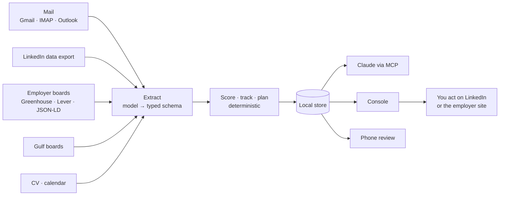

# Career Copilot — Roadmap

26 Sep 2026 · Moayed Badawy · Exported from the roadmap doc; the work queue lives in `docs/ISSUE_REGISTER.md`.

Career Copilot should stop trying to change how the world uses LinkedIn and become the trusted, local job-search system for the candidates LinkedIn serves worst — Gulf and MENA tech first — with verified, evidence-backed applications as the wedge.

## Where it stands today

The safety layer is production-grade; the scoring engine, which is the actual product, is not yet trustworthy. That is the gap every phase below closes first.

| Area | State on 26 Sep 2026 (v0.3.0 + Unreleased, 15 PRs) |
| --- | --- |
| Approval boundary | Held under every attack: no approve tool for Claude, single-use login, cross-site POST refused, claims must be ticked, stored XSS escaped plus strict CSP |
| Untrusted input | Hidden prompt injection and fee scams caught and filed as suspicious |
| Engineering | 366 of 367 tests pass, 17 in a real browser; `doctor`, one-click `.mcpb` bundle, Console with 12 screens |
| Scoring | Tiers collapse on alert-only jobs (9 of 9 "promising"); non-QA roles leak in; alternatives misread |
| Matching | "e&" can never match, so referrals fail on a top Gulf employer |
| Setup | Needs a terminal, uv, Claude Desktop and your own Google Cloud OAuth client |
| Audience | One user so far: you |

The full defect list with fixes is in `docs/ISSUE_REGISTER.md`.

## Premortem: it's September 2027 and it failed

The most likely failure isn't a security breach. It's quieter: nobody else could install it, the tiers stopped being believed, and the one user got a job and stopped opening it.

| # | Why it failed | Likelihood | Early warning sign | Prevention |
| --- | --- | --- | --- | --- |
| P1 | Nobody else could install it: terminal, uv, Claude Desktop and a personal Google Cloud OAuth client | High | Beta testers drop off before the first scored job | Phase 1: installer, no-OAuth mail route, 10-minute first result |
| P2 | The tiers weren't believed: senior roles in Dubai showed as "promising" whatever the title | High | You re-read every job yourself instead of trusting the tier | Phase 0 fixes, then a labelled evaluation set with a precision target |
| P3 | The paste tax won: LinkedIn descriptions are paste-only, pasting stopped by week two, tiers stayed title-only | High | Share of scored jobs with a description falls below 50% | One-action capture that stays inside the rules (Phase 1) |
| P4 | LinkedIn's own Job Match got good enough, so a second scorer felt redundant | High | Users say "LinkedIn already tells me this" | Compete where LinkedIn can't: other boards, the whole pipeline, verified claims |
| P5 | Email layouts changed and the parser silently returned zero jobs for weeks | Medium | A sync reports zero jobs from emails that clearly contain some | Parser health checks, alarms on zero-yield, fixture refresh |
| P6 | The builder's own search ended: you were hired and the only user left | High | Opens per week fall after an offer | Design for the whole career, and get 20 other users before your search ends |
| P7 | Breadth beat depth: 15 PRs in 9 days, more screens, same broken scorer | High | New features land while the issue register grows | Freeze features until Phase 0 exits |
| P8 | Built for one: QA taxonomy, Gulf boards, one person's habits | Medium | Non-QA testers get nonsense scores | Taxonomy packs and market packs, not hard-coded lists |
| P9 | Platform friction: a browser clipper drew a LinkedIn objection, or Gmail's restricted-scope review blocked distribution | Medium | A takedown notice or a stuck app review | Capture routes that don't operate on LinkedIn pages; a mail route that needs no Google review |
| P10 | A trust incident: an unverified number went out because the tick box became muscle memory | Low | Claims ticked in under two seconds | Evidence links, not tick boxes (Phase 3) |
| P11 | Nothing paid for it, so nothing justified another evening on it | Medium | No one asks to pay, sponsor or contribute | Decide the model at Phase 4, not later |

## Hard criticism of the idea

The code is better than the concept is sharp. These are the criticisms a skeptical investor or senior PM would make, and each one shapes the plan.

- **The name promises what the architecture forbids.** "AI integration with LinkedIn" sets up an expectation of inbox and feed access that the tool rightly refuses. People who install it for that will leave disappointed. Rename and reposition around what it does.
- **"Change the market globally" is the reddest ocean there is.** It means going head-on with LinkedIn, its Premium Job Match and a crowded field of funded tools. A blue-ocean rule of aiming for less-common MENA niches argues for the opposite move.
- **It never measures the outcome that matters.** Nothing tracks interviews per application, so there's no evidence it gets anyone hired faster. Every feature so far is an input, not a result.
- **Keyword taxonomies are 2015 matching in a 2026 world.** Determinism is the right call for the *score*, since it keeps the score explainable. But using regexes to *read* job descriptions is why "(or Selenium)" breaks. The model should extract, and the code should score.
- **The distribution channel is tiny.** Claude Desktop plus an MCP server plus a terminal is a developer audience. Most job seekers will never open a terminal.
- **The friction that protects you costs everyone else.** Approving in a separate surface is right for your primary account. For a wider audience it needs to feel like one quick decision, not a context switch.
- **There's no moat except craft.** It's single-player and local by design, so there's no data flywheel or network effect. That's fine for a tool, but it's not enough to change a market unless something else creates a two-sided reason to exist.

## Challenges and how to break through

The biggest breakthrough: stop treating LinkedIn as the data source. **Your mailbox and employers' own public job boards already hold nearly everything the job search needs, and both can be read legitimately.**

| Challenge | Why it's hard | Breakthrough |
| --- | --- | --- |
| No LinkedIn data access | No official API gives an individual their inbox, feed or jobs. Scraping breaks the User Agreement | Make email the integration layer. Every applicant tracking system (Greenhouse, Lever, Workday, SAP SuccessFactors, Oracle) emails confirmations, interview invites and rejections, so the pipeline tracks itself across every employer, LinkedIn included |
| LinkedIn descriptions are paste-only | Scoring skills needs the description, and pasting stops after a week | Look for the same job on the employer's own board. Greenhouse's [Job Board API](https://docs.greenhouse.io/job-board.html) and Lever's [Postings API](https://github.com/lever/postings-api) are public and unauthenticated for published jobs and return full descriptions. Many LinkedIn jobs also say "Apply on company website" |
| LinkedIn's own Job Match | First-party, full data, bundled in Premium | Don't compete on one job's fit. Compete on what LinkedIn can't see: other boards, the whole pipeline across employers, verified claims, career path, privacy |
| Distributing Gmail access | `gmail.readonly` is a [restricted scope](https://developers.google.com/workspace/gmail/api/auth/scopes). A shared app needs Google verification plus a [security assessment every 12 months](https://developers.google.com/identity/protocols/oauth2/production-readiness/restricted-scope-verification). Bring-your-own-client only fits the personal-use exception | Offer three mail routes: Claude's Gmail connector (exists), IMAP with an app password, and a local forwarding address. A shared verified app only once there's demand to fund the assessment |
| Scoring trust | Regexes misread real job-description phrasing | The model extracts requirements into a typed schema, the code scores them deterministically, and a labelled evaluation set measures precision |
| Setup friction | Terminal, uv, Claude Desktop, OAuth client | One installer, a Console-first setup wizard, first scored job from a pasted CV in under 10 minutes |
| Distribution | The MCP audience is small and developer-heavy | Go where MENA tech job seekers already are: QA and developer communities, bootcamps, university career offices, Arabic tech content. Dogfood in public |
| Builder time | Full-time job plus an active search | Phase gates, a feature freeze until the scorer passes its evaluation, one release a fortnight |

## What to build to change the market

Hiring is going through a trust collapse, and the scarce thing in it is verified signal. Career Copilot already holds the unusual ingredients to supply that: claim checks, human approval, text locked by hash, and an append-only audit log.

The evidence, from Greenhouse's [2025 AI in Hiring survey](https://www.greenhouse.com/newsroom/an-ai-trust-crisis-70-of-hiring-managers-trust-ai-to-make-faster-and-better-hiring-decisions-only-8-of-job-seekers-call-it-fair) of 4,136 people across the US, UK, Ireland and Germany:

- 91% of recruiters have spotted candidate deception, and 34% spend up to half their week filtering spam and junk applications.
- 41% of job seekers admit to using prompt injection to get past AI filters.
- 46% of US job seekers say their trust in hiring fell over the past year.

Auto-apply tools feed that flood. The market-changing move runs the other way: **fewer applications, each one provable.**

**Positioning:** *The job-search copilot that never sends anything you haven't approved, and never claims anything you can't prove.*

### Three bets

| Bet | What it is | Why it could change things | Risk |
| --- | --- | --- | --- |
| 1. Verified applications | Every number and claim in a CV, cover note or message links to evidence: a repo, a certificate ID, a published post, a date matching the employment record. The application carries a small evidence card a recruiter can open and check | It turns the claims checker already built into something the other side of hiring values. It's two-sided without needing LinkedIn | Recruiters must learn to trust a new artefact. Start with candidates, who benefit on their own |
| 2. MENA-first career system | The whole search in one place for Gulf and Egypt tech: Bayt, GulfTalent, NaukriGulf, Wuzzuf, employer boards, Arabic support, visa and relocation checks, fee-scam protection | LinkedIn doesn't aggregate these boards, and overseas job seekers are prime targets for fee scams | A smaller market. Beat it with depth, not breadth |
| 3. Approval receipts as an open pattern | Publish the approval boundary as a reusable pattern: no approve tool for the agent, approval on a separate surface, a hash receipt of the exact approved text | Every agent that drafts on someone's behalf (email, Slack, CRM) needs this. It could become an MCP extension proposal | Hard to monetise directly. Its value is reputation and adoption |

### What not to build

- Auto-apply, mass outreach or connection automation, however much users ask for it. It adds to the flood this product exists to counter.
- Anything that logs into LinkedIn, reads its pages automatically, or stores a session cookie.
- A generic global job board. That's the red ocean.

## All-in-one: one engine, many surfaces

All-in-one means one local engine that owns the whole search: every source feeds it, every surface reads from it, and nothing leaves without your approval. The AI model is a component you can swap (Claude, a local Ollama model, or none), not the foundation.

Sources are read-only and allowlisted. The model only structures text, and the code decides every score and state.

### Data model

| Entity | Holds | Fed by |
| --- | --- | --- |
| Job | Title, company, location, description, requirement schema, score, tier | Alerts, saved jobs, employer boards, paste |
| Application | Stage (applied, screening, interview, offer, rejected), dates, next step | ATS emails, your updates |
| Company | Normalised name, aliases, boards it uses, sponsor status, people you know | Export, boards, sponsor register |
| Conversation | Who, last message preview, owed reply, category, flags | Notification emails, export |
| Evidence | A claim, its proof (link, certificate ID, date), verified-by, last checked | You, with the model's help |
| Skill | Name, level, evidence, in progress | Profile, courses, evidence |
| Draft · Receipt | Text, checks, approval hash, actor, outcome | Claude, you |
| Course · Plan | Skill gap, hours, progress, what it unlocks | Gap analysis, you |

### Integrations

| Integration | Direction | Scope | Phase |
| --- | --- | --- | --- |
| Gmail / IMAP / Outlook | Read | Allowlisted senders: job boards plus ATS domains | 1 |
| Employer ATS boards (Greenhouse, Lever) | Read | Public published postings only | 1 |
| LinkedIn data export | Read | Your own ZIP | Done |
| Google or Outlook Calendar | Write, approved | Interview slots and follow-up reminders | 2 |
| Google Drive or local folder | Read | CV versions and evidence files | 2 |
| Sheets / Notion / CSV | Export | Your pipeline, on request | 2 |
| Local model (Ollama) | Local | Extraction without sending text anywhere | 3 |

### Packs, not hard-coding

- **Taxonomy packs**: QA, DevOps, Data, Backend, Product. Each is a versioned file with skills, aliases, implications and alternatives.
- **Market packs**: GCC, Egypt, UK, EU. Each holds boards, locations, visa and sponsor rules, salary sources and scam patterns.
- **Language packs**: English and Arabic interface, with right-to-left content handled everywhere.

## Missing value to add

The biggest gap is the second half of the search: after you apply, the tool goes blind. Closing that gap, and measuring outcomes, adds more value than any new screen.

| Value | What it does | Impact | Effort | Phase |
| --- | --- | --- | --- | --- |
| Company alias graph | e&, Etisalat by e& and Emirates Telecommunications Group are one company, so referrals and dedupe work | High | Low | 0 |
| CV import | Paste or drop a CV and get a scored profile in minutes: skills, level, titles, dates | High | Medium | 1 |
| Description resolver | Finds the same job on the employer's public Greenhouse, Lever or JSON-LD page and fills the description | High | Medium | 1 |
| Automatic application tracking | Reads ATS confirmation, interview and rejection emails and moves each application through its stages by itself | High | Medium | 1–2 |
| Outcome analytics | Applied → screen → interview rates by tier, source and CV version. Shows whether "matched" actually converts | High | Low | 2 |
| Follow-ups and calendar | "No reply in 7 days", thank-you notes after interviews, interview slots, all as drafts you approve | Medium | Low | 2 |
| Interview prep pack | For jobs at interview stage: likely topics from missing skills, STAR stories from your evidence, company notes | High | Low | 2 |
| Rejection reasons | Captured in one click and shown as patterns ("3 rejections cite Kubernetes"). Never silently reweights the scorer | Medium | Low | 2 |
| MENA scam patterns | Fee, visa and "agency" scam signatures shipped in the market pack, updated each release | Medium | Low | 2 |
| Evidence ledger | Each claim gets its proof, and drafts may only use claims with evidence | High | Medium | 3 |
| Tailored CV per job | Built only from ledger claims, with a diff against your base CV | High | Medium | 3 |
| Salary and offer view | Offers compared on base, housing and transport allowances, visa and cost of living, from sources you cite | Medium | Medium | 3 |
| Verified evidence card | A shareable page where a recruiter can check each claim's proof | High | High | 4 |
| Career after the search | Yearly profile refresh, a promotion case built from evidence, skills growth over time. It keeps you using it once hired | Medium | Medium | 4 |

## Easy to set up, easy to integrate

The target is **install to first scored job in under 10 minutes, without opening a terminal.** Today it takes a terminal, uv, hand-edited TOML, Claude Desktop config and a personal Google Cloud project.

### Install

- **One installer per OS**, Windows first because most Gulf and Egypt job seekers use Windows. It bundles its own Python through uv, starts a background service, and opens the Console.
- **Claude Desktop stays optional.** The `.mcpb` bundle already exists for people who want chat. Everything else works from the Console alone.
- **Terminal commands remain** for power users, but the Console gets parity for anything a setup or recovery needs.

### Setup wizard in the Console

1. **Drop your CV.** The model drafts titles, level, skills and dates, and you confirm each one. This replaces editing `profile.toml`.
2. **Confirm targets**: countries, cities, levels, titles to exclude.
3. **Connect mail**, choosing one of the routes below.
4. **Optional: LinkedIn export.** Instructions with screenshots, then drop the ZIP.
5. **Optional: connect Claude.** Either install the bundle, or let the wizard write the Desktop config once you approve it.
6. **First result**: your jobs scored and your top three actions for today.

### Mail routes, from easiest to most private

| Route | Setup | What it can reach | Best for |
| --- | --- | --- | --- |
| Claude's Gmail connector | Nothing new | Whatever Claude reads, passed through the chat | Trying it out |
| Dedicated job-search mailbox | A Gmail filter forwards job and ATS mail to a new address. The copilot reads only that box | Only forwarded job mail. A leak exposes nothing personal | **Recommended default** |
| IMAP with an app password | 2-Step Verification plus an [app password](https://support.google.com/mail/answer/185833?hl=en), stored in the OS keychain | The whole mailbox over IMAP, so open it read-only and search allowlisted senders only | People who won't set up forwarding |
| Your own OAuth client (today's route) | A Google Cloud project | `gmail.readonly`, allowlisted senders | Developers |
| Verified shared OAuth app | Google verification plus an annual security assessment | `gmail.readonly` | Only once revenue or a sponsor can fund the assessment |

Google discourages app passwords, and an app password reaches more than `gmail.readonly` does. That's why the dedicated-mailbox route is the default: it limits what any leak could expose.

### Efficient integration

- **Background sync on a local schedule.** Mail, boards and feeds refresh every few hours without Claude running. Claude reads results, not raw mail.
- **Incremental and idempotent.** Cursors per source, message-id dedupe, and one storage path for every route (already true for Gmail and pasted email).
- **Parser health.** Each source reports its yield, and "12 alert emails, 0 jobs" raises an alarm instead of failing silently.
- **Schema migrations.** `PRAGMA user_version` with numbered migrations, so an update never needs a purge.
- **Plain-language status.** No tool names in the interface: "paste the description", not "use update_job".

## Building it powerful

Power here means one thing: **a score you can bet an application on.** That takes a better reader for job descriptions, a scorer that stays deterministic, and a test harness that proves both.

### Scoring v2

1. **Extract.** The model turns a description into a typed requirement schema: each requirement's skill, required or preferred, alternative group, years, and the exact words it came from. It also captures level, work mode, location, visa or sponsorship, stated salary and language needs such as Arabic.
2. **Ground.** Any requirement whose quoted words aren't in the description is dropped. That stops the model inventing requirements, and the check is pure code.
3. **Score.** The current deterministic scorer runs on the schema. Alternatives come from the schema's groups. A title-family gate sends non-QA titles to low fit when there's no description.
4. **Fall back.** With no model available, today's regex reader runs and the job is marked lower confidence.
5. **Cache.** Extractions are keyed by a hash of the description, so a job is read once.

### Evaluation harness

| Measure | How | Gate |
| --- | --- | --- |
| Tier accuracy | 200 hand-labelled postings: Gulf and Egypt QA, adjacent roles, clearly off-target roles | ≥ 85% exact, ≥ 97% within one tier |
| "Matched" precision | Share of matched jobs you'd genuinely apply to | ≥ 90% |
| Off-target leak | Non-QA jobs shown as close or above | ≤ 2% |
| Required-skill extraction | F1 against the labels | ≥ 0.90 |
| Alternatives | Phrasings like "X or Y", "X (or Y)", "X, Y or Z", "e.g. X, Y", "X/Y", plus Arabic descriptions | 100% on the phrasing suite |
| Parser yield | Real email samples per source, refreshed monthly | Zero-yield on a known-good sample fails CI |
| Regression diff | Every scorer change prints the jobs that changed tier and why | Reviewed before merge |

Outcome data from Phase 2 (interview rates per tier) is shown alongside, as calibration you can see. It never tunes the weights silently.

### Local AI

- Extraction is a background batch job, so a small quantized model through Ollama is enough and runs on an 8 GB laptop without a GPU. Speed doesn't matter here; privacy and cost do.
- Model choice is a setting: Claude through MCP, a local model, or none. The score stays the same kind of deterministic output whichever model does the reading.

### Hardening that comes with power

- Each source is an adapter with contract tests, so community boards can be added without touching the core.
- Writes that span tables run in one transaction, feeds and boards fetch concurrently, and every `href` gets a scheme check.
- "Mark as done" moves to the human side, or at least needs a Console confirmation, so an injected instruction can't hide an approved draft.

## Phased roadmap

Five phases over about 28 weeks, from 28 Sep 2026 to mid-April 2027. The plan assumes 8–10 hours a week alongside a full-time job. No phase starts until the previous one meets its exit criteria.

| Phase | Dates | Goal | Build | Exit criteria |
| --- | --- | --- | --- | --- |
| 0 · Stabilise | 28 Sep – 11 Oct | A score you can believe | Every item on the Issue register, the company alias graph, the alternatives phrasing suite, `PRAGMA user_version`, one transaction per import, green CI. **Feature freeze** | All found issues closed with a test each. "e& UAE" referral works. No non-QA title above low fit without a description |
| 1 · Easy | 12 Oct – 15 Nov | Anyone installs it, and descriptions arrive by themselves | Windows and macOS installer, Console setup wizard, CV import, dedicated-mailbox and IMAP routes, description resolver (Greenhouse, Lever, JSON-LD), background sync, parser health, plain-language status | 5 non-developer testers reach a scored job in under 10 minutes. At least 60% of active jobs have a description without pasting |
| 2 · Complete | 16 Nov – 20 Dec | The whole search in one place | Application tracking from ATS emails, outcome analytics, follow-ups and calendar, interview prep pack, rejection reasons, MENA scam pack, Arabic content support | Your own pipeline runs for 4 weeks with at most one manual status fix a week. **20 beta users** before your own search ends |
| 3 · Powerful | 4 Jan – 14 Feb 2027 | Scores worth betting on, claims worth trusting | Extraction schema with grounding, 200-posting evaluation harness in CI, local-model option, evidence ledger, tailored CV from evidenced claims | Every gate in the harness table met. Drafts can use only claims that have evidence |
| 4 · Market | 15 Feb – 18 Apr 2027 | Something the market notices | Verified evidence card and recruiter verifier page, DevOps and Data taxonomy packs, UK and EU market packs, approval-receipt pattern write-up and MCP proposal, business-model decision, launch in MENA tech communities | 100 weekly active users, 10 recruiters opened an evidence card, business model chosen |

The gap between 20 Dec and 4 Jan is deliberate. It absorbs slippage.

## Metrics and kill criteria

The north-star metric is **interviews per 10 applications, compared with the user's own rate before the tool.** Everything else is a leading indicator for it. All metrics stay local and are shown on the Data screen. Nothing is sent anywhere.

| Metric | Target | Measured from |
| --- | --- | --- |
| Install to first scored job | Under 10 minutes | Phase 1 |
| Jobs with a description, no pasting | At least 60% | Phase 1 |
| "Matched" precision on the harness | At least 90% | Phase 3 |
| Weekly active users | 20, then 100 | Phase 2, then Phase 4 |
| Still active in week 4 | At least 40% | Phase 2 |
| Drafts edited before approval | Between 30% and 80%. Above that means drafts are poor; below it suggests rubber-stamping | Phase 2 |
| Claims ticked in under 2 seconds | Flagged every time, as rubber-stamping | Phase 2 |
| Anything sent without approval | Zero, always. This is an invariant, not a target | Now |

### Kill or pivot when

- **Fewer than 3 of 5 non-developer testers finish setup** after Phase 1. Stop broad distribution and keep it an open-source personal tool.
- **Under 20 beta users, or under 25% still active in week 4**, after Phase 2. Drop the market phase and publish the approval-receipt pattern on its own.
- **"Matched" precision stays below 80%** after Phase 3. Stop presenting tiers as recommendations and show evidence and gaps only.
- **LinkedIn ships cross-board aggregation for MENA, or native ATS tracking.** Pivot to evidence and verification alone, which LinkedIn is structurally slow to offer.
- **Any source draws a platform objection.** Remove that source within a week, no argument.

## Decisions to make now

| # | Decision | Recommendation | Why | Decide by |
| --- | --- | --- | --- | --- |
| 1 | Positioning | Drop "LinkedIn integration". Lead with *verified, human-approved job search for MENA tech* | The current framing promises access the tool rightly refuses | 4 Oct |
| 2 | Name | Check "Copilot" before any public launch | Microsoft, which owns LinkedIn, uses "Copilot" as a product brand. A career tool about LinkedIn carrying that name invites avoidable friction | Before Phase 4 |
| 3 | Feature freeze | Yes, until Phase 0 exits | Breadth outrunning depth is failure mode P7 | Now |
| 4 | Default mail route | Dedicated job-search mailbox | Lowest leak impact, no Google review needed | Phase 1 start |
| 5 | Scope | QA and SDET only through Phase 3, other packs in Phase 4 | Depth wins a niche, and the harness needs one domain to be rigorous | Now |
| 6 | Business model | Keep the core MIT. Later, charge for hosted evidence cards and cohort licences for bootcamps and university career offices | Candidates in a job search pay reluctantly. Institutions that place people pay for outcomes | Lean now, decide in Phase 4 |
| 7 | First 20 users | Recruit now from MENA QA and SDET engineers you know. Offer early access in exchange for weekly feedback | Your own search could end before Phase 2, and the product needs users who aren't you | Recruit by Phase 1 end |

## Sources

- [Greenhouse: An AI trust crisis — 2025 AI in Hiring survey](https://www.greenhouse.com/newsroom/an-ai-trust-crisis-70-of-hiring-managers-trust-ai-to-make-faster-and-better-hiring-decisions-only-8-of-job-seekers-call-it-fair)
- [Google: Gmail API scopes and their classification](https://developers.google.com/workspace/gmail/api/auth/scopes)
- [Google: Restricted scope verification](https://developers.google.com/identity/protocols/oauth2/production-readiness/restricted-scope-verification)
- [Google: Sign in with app passwords](https://support.google.com/mail/answer/185833?hl=en)
- [Greenhouse Job Board API](https://docs.greenhouse.io/job-board.html)
- [Lever Postings API](https://github.com/lever/postings-api)
- [LinkedIn Premium Career](https://premium.linkedin.com/careers/career)
